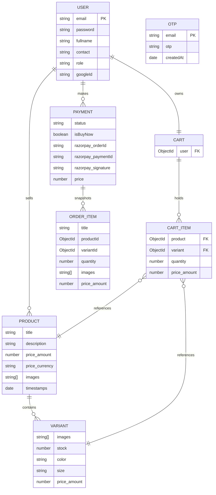
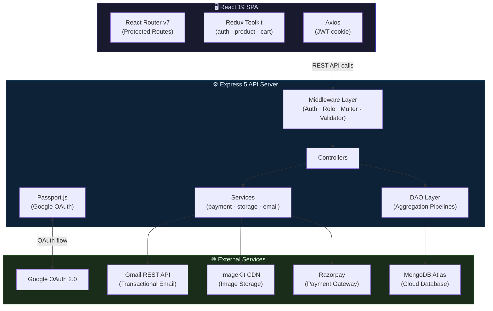
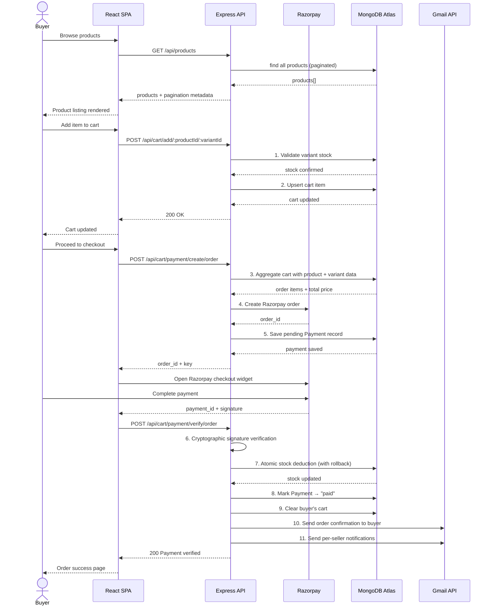
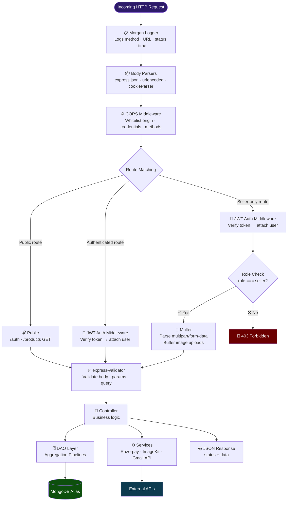

# SNITCH — Modern Streetwear E-Commerce Platform

> A production-grade, multi-vendor marketplace where streetwear brands list, manage, and sell products directly to buyers — complete with real-time payments, transactional emails, and role-based seller dashboards.

🔗 **Live Deployment:** [snitch-trend.onrender.com](https://snitch-trend.onrender.com)

---

## Table of Contents

- [Overview](#overview)
- [Key Features](#key-features)
- [Tech Stack](#tech-stack)
- [Data Model](#data-model)
- [System Architecture](#system-architecture)
- [Application Flow — Checkout Journey](#application-flow--checkout-journey)
- [Backend Request Lifecycle](#backend-request-lifecycle)
- [Folder Structure](#folder-structure)
- [Setup & Installation](#setup--installation)
- [API Reference](#api-reference)
- [Roadmap](#roadmap)

---

## Overview

**SNITCH** is a full-stack, multi-vendor e-commerce platform purpose-built for the streetwear niche. Sellers manage product catalogs with variant-level control — size, color, stock, per-variant pricing, and dedicated imagery — while buyers browse, filter, add to cart, and checkout via **Razorpay**.

The platform handles the complete commerce lifecycle: from registration and Google OAuth sign-in through payment verification with atomic stock deduction, all the way to branded transactional email dispatch to both buyers and sellers.

---

## Key Features

### 🔐 Authentication & Security

- **JWT cookie-based sessions** — 7-day token expiry with HTTP-only cookies; no token exposure to JavaScript
- **Google OAuth 2.0** — Frictionless one-click sign-in via Passport.js
- **OTP password reset** — Time-limited 10-minute codes auto-expiring via MongoDB TTL indexes, preventing replay attacks
- **Role-based access control** — Distinct `buyer` and `seller` roles enforced at the middleware layer
- **Input validation** — `express-validator` on all mutation endpoints
- **Rate limiting** — Strict 15 attempts/15 min on auth routes; 100 requests/15 min globally via `express-rate-limit`

### 🛍️ Product Management (Seller)

- **Multi-image listings** — Up to 7 images per product, streamed directly to ImageKit CDN (no disk I/O)
- **Variant system** — Size, color, and custom attributes per variant, each with independent pricing, stock, and images
- **Full CRUD** — Create, update, and delete products and individual variants via protected endpoints
- **Seller dashboard** — Centralized view of all listed products with inline management controls

### 🛒 Shopping & Checkout (Buyer)

- **Advanced search** — Multi-filter: text query, price range, size, color, and sort options
- **Stock-aware cart** — Quantity adjustments validated against real-time inventory with clear user feedback
- **Dual purchase flows** — Buy Now (instant) and Cart Checkout, both routing through the same payment pipeline
- **Razorpay integration** — Server-side order creation, client-side checkout widget, and cryptographic signature verification
- **Server-side pagination** — Returns `currentPage`, `totalPages`, `totalProducts`, `limit` metadata

### 📦 Order Processing & Notifications

- **Atomic stock deduction with rollback** — On payment verification, stock decrements per-variant; any failure reverses all prior deductions
- **Branded transactional emails** — Gmail REST API (OAuth2, no SMTP): welcome, OTP, order confirmation, and per-seller notifications
- **Dev email fallback** — When credentials are absent, emails log to console for seamless offline development

### 🎨 Frontend

- **React 19 SPA** with React Router v7 protected route guards
- **Redux Toolkit** — Centralized state across auth, product, and cart domains
- **Feature-based architecture** — Isolated modules (auth, products, cart, shared)
- **Tailwind CSS v4** with premium typography — Bebas Neue + DM Sans for a genuine streetwear aesthetic

---

## Tech Stack

| Layer | Technology | Purpose |
|-------|------------|---------|
| **Frontend** | React 19 | Component-based UI with hooks |
| **Frontend** | React Router v7 | Client-side routing with protected routes |
| **Frontend** | Redux Toolkit | Centralized state management |
| **Frontend** | Tailwind CSS v4 | Utility-first responsive styling |
| **Frontend** | Axios | HTTP client with cookie credentials |
| **Build** | Vite 8 | Dev server with HMR and API proxy |
| **Backend** | Express 5 | REST API framework |
| **Backend** | Passport.js | Google OAuth 2.0 strategy |
| **Backend** | JSON Web Tokens | Stateless session authentication |
| **Backend** | express-validator | Request input validation |
| **Backend** | Multer | Multipart form-data / image upload parsing |
| **Backend** | bcrypt | Password hashing (10 salt rounds) |
| **Backend** | express-rate-limit | Brute-force and API abuse protection |
| **Database** | MongoDB Atlas | Cloud-hosted document database |
| **Database** | Mongoose 9 | ODM with schema validation and aggregation pipelines |
| **Payments** | Razorpay | Order creation, payment capture, signature verification |
| **Storage** | ImageKit | CDN-backed image storage and optimization |
| **Email** | Gmail REST API | Transactional email dispatch via OAuth2 |
| **DevOps** | Render | Full-stack cloud deployment |
| **Logging** | Morgan | HTTP request logging in development |
| **Testing** | Jest + Supertest | Test runner, expectations, HTTP integration tests |
| **Testing** | mongodb-memory-server | In-memory isolated database for tests |
| **CI/CD** | GitHub Actions | Automated testing and verification workflow |

---

## Data Model

### Entity Relationship Overview



### Design Decisions

- **Embedded variants** — Variants live inside Products since they're always accessed together; no extra query overhead
- **Order snapshots** — Payment records store immutable item copies at purchase time, so edits or deletions never corrupt order history
- **Shared `priceSchema`** — A reusable `{amount, currency}` subdocument spans Products, Variants, Cart Items, and Payments for consistent multi-currency support
- **TTL auto-expiry** — OTP documents self-destruct via MongoDB TTL index after 10 minutes — no cron jobs required

---

## System Architecture



> The architecture follows a **monolithic REST API** pattern. The React SPA is served as static assets from Express in production, eliminating CORS complexity and simplifying deployment to a single Render service. External services are cleanly abstracted behind dedicated service modules, making each independently swappable.

---

## Application Flow — Checkout Journey



### Step-by-Step Breakdown

| Step | Action | Detail |
|------|--------|--------|
| **1** | Stock validation | Cart operations check variant-level inventory in real-time before allowing additions or quantity changes |
| **2** | Cart upsert | Increments quantity if item exists; creates new cart item otherwise |
| **3** | Cart aggregation | MongoDB pipeline joins cart items with products and variants to compute the total price |
| **4** | Razorpay order | Server-side order created with computed amount; frontend opens Razorpay checkout widget |
| **5** | Payment record | Pending payment document created with all order item snapshots before payment |
| **6** | Signature verification | Razorpay signature cryptographically verified server-side to prevent tampering |
| **7** | Atomic stock deduction | Stock decremented per-variant; full compensating rollback if any item has insufficient inventory |
| **8** | Status transition | Payment transitions `pending` → `paid` with Razorpay IDs stored |
| **9** | Cart cleanup | Buyer's cart cleared after successful payment |
| **10** | Buyer email | Branded HTML order confirmation with itemized details via Gmail REST API |
| **11** | Seller emails | Each seller with items in the order receives a separate notification with their specific items and earnings |

---

## Backend Request Lifecycle



> Every request traverses Morgan logging, body parsing, and CORS before hitting the route matcher. Access-protected endpoints pass through JWT authentication, role verification, file upload parsing, and input validation — in that order — before reaching the controller. Controllers delegate to the DAO layer for complex aggregations and to dedicated service modules for external integrations.

---

## Folder Structure

```
Snitch/
├── .github/
│   └── workflows/
│       ├── deploy.yml              # Render deployment workflow
│       └── test.yml                # CI test workflow
│
├── Backend/
│   ├── public/                     # Production frontend build (served as static)
│   ├── src/
│   │   ├── config/
│   │   │   ├── config.js           # Centralized env-var loader & validator
│   │   │   └── database.js         # Mongoose connection setup
│   │   ├── controllers/
│   │   │   ├── auth.controller.js  # JWT, OTP, Google OAuth logic
│   │   │   ├── cart.controller.js  # Cart, payment, and email notifications
│   │   │   └── product.controller.js # Product & variant CRUD + search
│   │   ├── dao/
│   │   │   ├── cart.dao.js         # Cart aggregation pipeline helpers
│   │   │   └── product.dao.js      # Variant inventory stock helpers
│   │   ├── middleware/
│   │   │   └── auth.middleware.js  # JWT check and role-based route guard
│   │   ├── models/
│   │   │   ├── cart.model.js       # Shopping cart schema
│   │   │   ├── otp.model.js        # Password-reset OTP schema (10 min TTL)
│   │   │   ├── payment.model.js    # Order payment + snapshot schema
│   │   │   ├── price.schema.js     # Reusable price subdocument
│   │   │   ├── product.model.js    # Product catalog + embedded variant schema
│   │   │   └── user.model.js       # User schema (buyer / seller)
│   │   ├── routes/
│   │   │   ├── auth.route.js       # Auth and validation routes
│   │   │   ├── cart.route.js       # Cart and checkout/payment routes
│   │   │   └── product.route.js    # Catalog and variant management routes
│   │   ├── services/
│   │   │   ├── payment.service.js  # Razorpay integration
│   │   │   └── storage.service.js  # ImageKit buffer image upload
│   │   ├── utils/
│   │   │   └── email.js            # Gmail REST API OAuth2 dispatcher
│   │   ├── validator/
│   │   │   ├── auth.validator.js   # Auth request validation rules
│   │   │   ├── cart.validator.js   # Cart request validation rules
│   │   │   └── product.validator.js # Product request validation rules
│   │   └── app.js                  # Express application setup
│   ├── tests/
│   │   ├── auth.test.js            # Authentication integration tests
│   │   ├── cart.test.js            # Cart and checkout integration tests
│   │   ├── product.test.js         # Product and variant catalog tests
│   │   └── setup.js                # Jest database setup configuration
│   ├── .env.example                # Environment variable reference template
│   ├── jest.config.js              # Jest runner configuration
│   ├── package.json                # Backend dependencies & scripts
│   └── server.js                   # Server entry point
│
└── Frontend/
    ├── public/                     # Static assets (icons, images)
    ├── src/
    │   ├── app/
    │   │   ├── App.jsx             # Root React component
    │   │   ├── app.routes.jsx      # React Router v7 routes & role validation
    │   │   └── app.store.js        # RTK global store
    │   ├── features/
    │   │   ├── auth/
    │   │   │   ├── components/     # Google OAuth button & auth guard
    │   │   │   ├── hook/useAuth.js # Auth logic and request wrapper
    │   │   │   ├── pages/          # Login · Signup · Password reset
    │   │   │   ├── service/auth.api.js  # Auth API functions
    │   │   │   └── state/auth.slice.js  # Auth RTK slice
    │   │   ├── cart/
    │   │   │   ├── hooks/useCart.js     # Cart interactions & checkout hook
    │   │   │   ├── pages/          # Checkout · Payment completion
    │   │   │   ├── service/cart.api.js  # Cart & order API helper
    │   │   │   └── state/cart.slice.js  # Cart items & totals slice
    │   │   ├── products/
    │   │   │   ├── hooks/useProduct.js  # Product management hooks
    │   │   │   ├── pages/          # Catalog · Detail · Seller dashboard
    │   │   │   ├── service/product.api.js  # Catalog API helper
    │   │   │   └── state/product.slice.js  # Catalog & filter state
    │   │   └── Shared/
    │   │       └── Components/
    │   │           ├── About.jsx   # Public about page
    │   │           └── Nav.jsx     # Responsive navigation header
    │   └── main.jsx                # Client entry point
    ├── eslint.config.js            # ESLint configuration
    ├── index.html                  # HTML shell
    ├── package.json                # Frontend dependencies & scripts
    └── vite.config.js              # Vite build and proxy configuration
```

---

## Setup & Installation

### Prerequisites

- Node.js ≥ 18
- MongoDB Atlas cluster (or local MongoDB instance)
- Razorpay test/live API keys
- ImageKit account
- Google Cloud project with OAuth 2.0 credentials (for sign-in and email sending)

### Backend

```bash
# 1. Clone the repository
git clone https://github.com/your-username/snitch.git
cd snitch/Backend

# 2. Install dependencies
npm install

# 3. Configure environment
cp .env.example .env
```

Edit `.env` with your credentials:

| Variable | Description |
|----------|-------------|
| `MONGO_URI` | MongoDB Atlas connection string |
| `JWT_SECRET_KEY` | Secret for signing JWTs |
| `GOOGLE_CLIENT_ID` | Google OAuth client ID |
| `GOOGLE_CLIENT_SECRET` | Google OAuth client secret |
| `IMAGEKIT_PRIVATE_KEY` | ImageKit private API key |
| `RAZORPAY_KEY_ID` | Razorpay key ID |
| `RAZORPAY_KEY_SECRET` | Razorpay key secret |
| `GOOGLE_REFRESH_TOKEN` | Gmail API refresh token |
| `GOOGLE_USER` | Gmail address used as sender |

```bash
# 4. Start development server
npm run dev
# → http://localhost:3000
```

### Frontend

```bash
# 1. Navigate to the frontend directory
cd ../Frontend

# 2. Install dependencies
npm install

# 3. Start development server
npm run dev
# → http://localhost:5173 (API calls proxied to backend)
```

---

## API Reference

### Authentication

| Method | Endpoint | Description | Auth Required |
|--------|----------|-------------|:---:|
| `POST` | `/api/auth/register` | Register a new buyer or seller account | — |
| `POST` | `/api/auth/login` | Login with email and password | — |
| `GET` | `/api/auth/google` | Initiate Google OAuth sign-in flow | — |
| `GET` | `/api/auth/google/callback` | Google OAuth callback — sets JWT cookie and redirects | — |
| `GET` | `/api/auth/me` | Get current authenticated user profile | ✅ |
| `GET` | `/api/auth/logout` | Clear auth cookie and log out | ✅ |
| `POST` | `/api/auth/forgot-password` | Send OTP to email for password reset | — |
| `POST` | `/api/auth/reset-password` | Verify OTP and set new password | — |

### Products

| Method | Endpoint | Description | Auth Required |
|--------|----------|-------------|:---:|
| `GET` | `/api/products` | List all products (paginated) | — |
| `GET` | `/api/products/search` | Search and filter with query params: `q`, `minPrice`, `maxPrice`, `size`, `color`, `sort` | — |
| `GET` | `/api/products/detail/:id` | Get product details by ID | — |
| `GET` | `/api/products/seller` | Get authenticated seller's products (paginated) | 🔒 Seller |
| `POST` | `/api/products` | Create a new product (multipart, up to 7 images) | 🔒 Seller |
| `PATCH` | `/api/products/update/product/:id` | Update product details | 🔒 Seller |
| `DELETE` | `/api/products/delete/:id` | Delete a product | 🔒 Seller |
| `POST` | `/api/products/:productId/variants` | Add a variant to a product | 🔒 Seller |
| `PATCH` | `/api/products/update/variant/:productId/:variantId` | Update a product variant | 🔒 Seller |
| `DELETE` | `/api/products/delete/variant/:productId/:variantId` | Delete a product variant | 🔒 Seller |

### Cart & Payments

| Method | Endpoint | Description | Auth Required |
|--------|----------|-------------|:---:|
| `GET` | `/api/cart` | Get current user's cart with aggregated totals | ✅ |
| `POST` | `/api/cart/add/:productId/:variantId` | Add item to cart (stock-validated) | ✅ |
| `PATCH` | `/api/cart/quantity/increment/:productId/:variantId` | Increment cart item quantity by 1 | ✅ |
| `PATCH` | `/api/cart/quantity/decrement/:productId/:variantId` | Decrement cart item quantity by 1 | ✅ |
| `DELETE` | `/api/cart/item/:productId/:variantId` | Remove item from cart | ✅ |
| `POST` | `/api/cart/payment/create/order` | Create Razorpay order from cart | ✅ |
| `POST` | `/api/cart/payment/buy-now` | Create Razorpay order for single item (Buy Now) | ✅ |
| `POST` | `/api/cart/payment/verify/order` | Verify Razorpay payment and finalize order | ✅ |

---

## Roadmap

| Feature | Description |
|---------|-------------|
| **Order history & tracking** | Persistent dashboard for buyers to view past purchases; sellers to update fulfillment status (processing → shipped → delivered) |
| **Wishlist & save-for-later** | Bookmark products and move items between wishlist and cart |
| **Review & rating system** | Verified buyers can leave star ratings and written reviews |
| **Admin analytics dashboard** | Platform-level metrics — sales, user growth, inventory alerts — for data-driven merchandising |
| **Expanded test coverage** | End-to-end frontend tests with Playwright/Cypress; unit tests for all controller functions |

---

<div align="center">

Built with ❤️ for the streets · Powered by React, Express, and MongoDB

</div>
